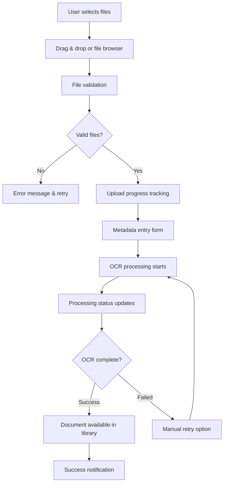
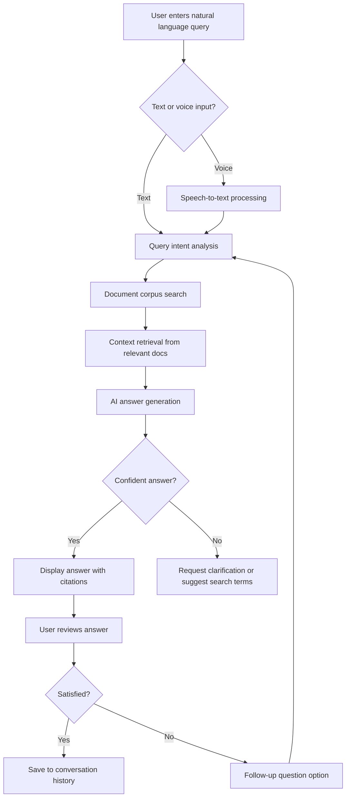

# PIE DOCS Frontend UI/UX Specification

## Introduction

This document defines the user experience goals, information architecture, user flows, and visual design specifications for PIE DOCS Frontend's user interface. It serves as the foundation for visual design and frontend development, ensuring a cohesive and user-centered experience.

### Overall UX Goals & Principles

#### Target User Personas

**Document Management Professionals**: Information managers, records specialists, compliance officers who need comprehensive document control, advanced search capabilities, and workflow management. They require efficiency, accuracy, and detailed audit capabilities.

**End Users & Department Staff**: Government employees and enterprise workers who create, access, and collaborate on documents. They need intuitive interfaces, quick document access, and streamlined approval processes without complexity.

**Field Workers & Mobile Users**: Personnel who need to scan barcodes, capture documents, and access information while mobile. They require simplified mobile interfaces, offline capabilities, and camera integration.

**Administrators & IT Managers**: System administrators who configure workflows, manage users, and monitor system performance. They need comprehensive control panels, analytics dashboards, and configuration tools.

#### Usability Goals

**Ease of Learning**: New users can complete core document upload and search tasks within 5 minutes, with bilingual onboarding supporting both Arabic and English speakers.

**Efficiency of Use**: Power users can complete frequent tasks (document search, workflow approval, barcode scanning) with minimal clicks and comprehensive keyboard shortcuts.

**Error Prevention**: Clear validation, confirmation dialogs for destructive actions, and intelligent auto-suggestions prevent common mistakes and data loss.

**Multilingual Excellence**: Seamless Arabic/RTL and English/LTR interface switching with proper cultural localization and font rendering.

**Mobile Optimization**: Touch-friendly interactions, camera integration for document capture, and offline synchronization for field operations.

#### Design Principles

1. **Bilingual Excellence First** - Every interface element designed for seamless Arabic/English switching with proper RTL support
2. **Progressive Disclosure** - Complex enterprise features revealed progressively, keeping simple tasks simple
3. **Conversational Intelligence** - Natural language interaction through RAG-based AI feels intuitive and helpful
4. **Physical-Digital Unity** - Seamless integration between barcode scanning, physical tracking, and digital workflows
5. **Enterprise Reliability** - Professional appearance with robust error handling and clear system status

### Change Log
| Date | Version | Description | Author |
|------|---------|-------------|---------|
| 2025-01-20 | 1.0 | Initial UI/UX specification creation based on comprehensive PRD | UX Expert Sally |

## Information Architecture (IA)

### Site Map / Screen Inventory

```mermaid
graph TD
    A[Login/Authentication] --> B[Main Dashboard]
    B --> C[Document Library]
    B --> D[Search & AI Chat]
    B --> E[Tasks & Workflows]
    B --> F[Physical Documents]
    B --> G[Analytics]
    B --> H[Administration]

    C --> C1[Grid View]
    C --> C2[List View]
    C --> C3[Tree View]
    C --> C4[Upload Interface]
    C --> C5[Document Viewer]
    C --> C6[Metadata Editor]
    C --> C7[Version History]
    C --> C8[Folder Management]

    D --> D1[Advanced Search]
    D --> D2[Faceted Filters]
    D --> D3[Saved Searches]
    D --> D4[NLP Query Interface]
    D --> D5[Conversation History]
    D --> D6[Search Analytics]

    E --> E1[Task Dashboard]
    E --> E2[Workflow Designer]
    E --> E3[Approval Queue]
    E --> E4[Task Assignment]
    E --> E5[Calendar Integration]

    F --> F1[Barcode Management]
    F --> F2[Location Tracking]
    F --> F3[Check-out/Check-in]
    F --> F4[Mobile Scanner]
    F --> F5[Physical Inventory]
    F --> F6[Movement History]

    G --> G1[Executive Dashboard]
    G --> G2[Usage Reports]
    G --> G3[Performance Metrics]
    G --> G4[Export Tools]

    H --> H1[User Management]
    H --> H2[Role Configuration]
    H --> H3[System Settings]
    H --> H4[Integration Setup]
    H --> H5[Audit Logs]
    H --> H6[Backup Management]
```



### Navigation Structure

**Primary Navigation:** Persistent sidebar navigation with collapsible sections for main functional areas (Documents, Search, Tasks, Physical, Analytics, Admin). Includes language switcher, user profile, and logout in header.

**Secondary Navigation:** Contextual tab navigation within each main section (e.g., Document Library has Grid/List/Tree tabs, Search has Basic/Advanced/AI Chat tabs). Breadcrumb navigation shows hierarchical location.

**Breadcrumb Strategy:** Dynamic breadcrumbs showing: Application Area > Sub-section > Current View/Document, with clickable navigation back to any level. Special handling for nested folder structures and workflow states.

## User Flows

### Document Upload and Processing

**User Goal:** Upload documents to the system with proper metadata and make them searchable through OCR processing

**Entry Points:** Main dashboard upload widget, Document Library upload button, drag-and-drop anywhere in document area

**Success Criteria:** Document successfully uploaded, OCR processing completed, metadata saved, document appears in library and is searchable

#### Flow Diagram


#### Edge Cases & Error Handling:
- File size exceeds limits - Clear error message with size restrictions
- Unsupported file format - List of supported formats with suggestion to convert
- Network interruption during upload - Auto-resume capability with progress preservation
- OCR processing fails - Manual text entry option with original file preserved
- Duplicate file detection - User choice to replace, rename, or skip
- Insufficient storage space - Clear storage usage display with cleanup suggestions

**Notes:** Mobile users can also access this flow through camera capture, which includes automatic document edge detection and image enhancement before following the same metadata and processing flow.

### Natural Language Document Query (RAG-based)

**User Goal:** Ask questions about document content in natural language and receive intelligent answers with source citations

**Entry Points:** Search & AI Chat section, global search bar with AI toggle, voice input button on mobile

**Success Criteria:** User receives relevant, accurate answer with clickable source citations and conversation history is maintained

#### Flow Diagram


#### Edge Cases & Error Handling:
- Ambiguous query - Clarification questions or multiple interpretation options
- No relevant documents found - Suggest alternative search terms or document upload
- AI service unavailable - Fallback to traditional search with apology message
- Language mixing (Arabic/English) - Auto-detect and process in both languages
- Very long response - Pagination or summary with "show more" option
- Citation links broken - Graceful handling with document title and metadata

**Notes:** Conversation context is maintained across sessions, allowing users to ask follow-up questions. Mobile users can use voice input with automatic language detection for hands-free operation.

### Physical Document Check-out Process

**User Goal:** Request and check out a physical document for temporary use with proper tracking

**Entry Points:** Document viewer "Request Physical Copy" button, Physical Documents section search, barcode scan result

**Success Criteria:** Physical document is reserved, approval obtained if required, location and pickup instructions provided, tracking record created

#### Flow Diagram
```mermaid
graph TD
    A[User finds physical document] --> B[Click "Request Physical Copy"]
    B --> C[Check availability status]
    C --> D{Available?}
    D -->|No| E[Show current holder & due date]
    D -->|Yes| F[Request form with purpose]
    F --> G{Approval required?}
    G -->|No| H[Immediate reservation]
    G -->|Yes| I[Send to approval workflow]
    I --> J{Approved?}
    J -->|No| K[Rejection notification with reason]
    J -->|Yes| H
    H --> L[Generate pickup instructions]
    L --> M[Location map & shelf details]
    M --> N[Physical retrieval by staff/user]
    N --> O[Barcode scan confirmation]
    O --> P[Check-out complete]
```

#### Edge Cases & Error Handling:
- Document already checked out - Show due date and reservation queue option
- User lacks permission for document type - Clear permission requirements message
- Approval timeout - Automatic escalation with notification to requestor
- Physical document not found at location - Report missing item workflow
- Barcode scan failure - Manual entry option with validation
- Overdue previous documents - Block new requests until returns are made

**Notes:** Mobile scanning interface allows field staff to update check-out status in real-time, with offline capability for areas with poor connectivity.

## Wireframes & Mockups

### Design Files

**Primary Design Files:** I recommend creating initial wireframes and mockups using Figma for collaborative design and easy developer handoff. We can start with low-fidelity wireframes for the key screens to establish layout and information hierarchy, then iterate to high-fidelity designs with your Tailwind CSS component system.

**Design Repository Structure:**
- **01-Wireframes:** Low-fidelity layouts for all major screens
- **02-Component-Library:** Tailwind-based component designs with variants
- **03-High-Fidelity:** Detailed screen designs with interactions
- **04-Bilingual-Versions:** Arabic RTL and English LTR versions
- **05-Mobile-Responsive:** Mobile and tablet adaptations

### Key Screen Layouts

#### Main Dashboard

**Purpose:** Provide personalized overview of document activity, quick actions, and system status for all user types

**Key Elements:**
- Customizable widget grid with drag-and-drop arrangement
- Quick upload zone with drag-and-drop visual feedback
- Recent activity timeline with filterable events
- AI chat quick access with conversation starters
- Task notifications with priority indicators
- Storage usage and system health indicators
- Language switcher prominently positioned
- User profile with role-based quick actions

**Interaction Notes:** Widgets can be added, removed, and rearranged with persistent user preferences. Mobile version stacks widgets vertically with swipe navigation.

**Design File Reference:** [dashboard-overview.fig - Main Frame]

#### Document Library Browser

**Purpose:** Provide flexible document browsing and organization with multiple view modes and advanced filtering

**Key Elements:**
- View mode toggle (Grid/List/Tree) with user preference memory
- Advanced filter panel with collapsible sections
- Bulk selection toolbar with contextual actions
- Document cards/rows with metadata previews
- Virtual scrolling for performance with large collections
- Folder breadcrumb navigation with click-to-navigate
- Sort controls with multiple criteria support
- Upload drop zone overlay when dragging files

**Interaction Notes:** Seamless switching between view modes preserves selection and filters. Right-click context menus provide quick actions. Keyboard shortcuts support power user workflows.

**Design File Reference:** [document-library.fig - Browser Views Frame]

#### AI Chat Interface

**Purpose:** Enable natural language document queries with conversational interface and citation display

**Key Elements:**
- Chat message thread with user and AI message differentiation
- Message input with voice recording button and language detection
- Source citation bubbles linked to specific documents
- Conversation history sidebar with search capability
- Query suggestions based on document content
- Confidence indicators for AI responses
- Follow-up question suggestions
- Export conversation option

**Interaction Notes:** Voice input shows real-time speech-to-text feedback. Citations are clickable and open documents in context. Mobile version optimizes for thumb typing and voice input.

**Design File Reference:** [ai-chat.fig - Conversation Interface Frame]

#### Mobile Document Scanner

**Purpose:** Enable field users to capture documents and barcodes with automatic enhancement and metadata entry

**Key Elements:**
- Full-screen camera viewfinder with overlay guides
- Automatic document edge detection with highlight
- Capture button with haptic feedback and success animation
- Image enhancement controls (brightness, contrast, crop)
- Quick metadata entry form with voice-to-text
- Batch scanning queue with thumbnail previews
- Upload progress with offline queue management
- Barcode recognition with automatic classification

**Interaction Notes:** One-handed operation support with bottom-positioned controls. Auto-capture when document is properly aligned. Offline mode stores captures until connectivity returns.

**Design File Reference:** [mobile-scanner.fig - Camera Interface Frame]

#### Workflow Designer

**Purpose:** Allow administrators to create document workflows using visual drag-and-drop interface

**Key Elements:**
- Canvas workspace with grid background and zoom controls
- Workflow element palette (start, approval, decision, notification, end)
- Connection lines with conditional routing labels
- Properties panel for selected elements
- Workflow testing simulation mode
- Template library with common patterns
- Version control with compare and rollback
- Validation indicators for workflow completeness

**Interaction Notes:** Drag-and-drop workflow building with snap-to-grid. Real-time validation with error highlighting. Testing mode simulates workflow execution with sample data.

**Design File Reference:** [workflow-designer.fig - Designer Canvas Frame]

## Component Library / Design System

### Design System Approach

**Design System Approach:** Build a custom component library using Tailwind CSS as the foundation, with extended utilities for Arabic RTL support and enterprise-specific patterns. This approach provides the flexibility needed for complex document management interfaces while ensuring consistency and developer efficiency.

**Key Strategy Elements:**
- **Tailwind CSS Foundation:** Leverage utility classes for rapid development and consistency
- **Custom Component Tokens:** Extended design tokens for enterprise colors, spacing, and typography
- **Bilingual Components:** Every component designed with both LTR and RTL variants
- **Accessibility First:** WCAG 2.1 AA compliance built into component architecture
- **Performance Optimized:** Tree-shakable components with minimal runtime overhead

### Core Components

#### Button Component

**Purpose:** Primary interaction element with clear visual hierarchy and accessible states

**Variants:** Primary (brand blue), Secondary (outlined), Ghost (text-only), Destructive (red), Success (green), Warning (orange)

**States:** Default, Hover, Active, Focus, Disabled, Loading (with spinner)

**Usage Guidelines:** Primary for main actions, Secondary for alternatives, Ghost for subtle actions. Always include focus indicators and loading states for async operations. RTL versions mirror icon positions.

#### Form Input Component

**Purpose:** Text input fields with validation, labeling, and bilingual text direction support

**Variants:** Text, Email, Password (with show/hide), Number, Search, Textarea, File Upload

**States:** Default, Focus, Error, Success, Disabled, Read-only

**Usage Guidelines:** Always include proper labels and validation messages. Support both Arabic and English text input with automatic direction detection. Error states must have sufficient color contrast and descriptive messages.

#### Card Component

**Purpose:** Content container for documents, widgets, and information display

**Variants:** Default, Interactive (hover effects), Elevated (drop shadow), Bordered, Compact

**States:** Default, Hover, Selected, Loading (skeleton), Error

**Usage Guidelines:** Use for document items, dashboard widgets, and content grouping. Interactive variants for clickable items. Loading skeletons maintain layout during data fetch. RTL versions adjust padding and alignment.

#### Navigation Component

**Purpose:** Site navigation with collapsible sidebar and responsive mobile menu

**Variants:** Sidebar (desktop), Mobile Menu (hamburger), Breadcrumbs, Tabs, Pagination

**States:** Default, Active, Hover, Collapsed, Expanded

**Usage Guidelines:** Sidebar navigation for desktop with collapsible sections. Mobile menu overlays content. Active states clearly indicate current location. Breadcrumbs support deep folder navigation. RTL versions mirror navigation direction.

#### Data Table Component

**Purpose:** Structured data display with sorting, filtering, and bulk operations

**Variants:** Basic, Sortable, Filterable, Selectable, Expandable Rows, Fixed Header

**States:** Default, Loading, Empty, Error, Selected Rows

**Usage Guidelines:** Use for document lists and administrative data. Include sort indicators and filter controls. Bulk selection with clear action buttons. Virtual scrolling for large datasets. RTL versions adjust column alignment.

#### Chat Message Component

**Purpose:** Conversational interface for AI chat with message threading and citations

**Variants:** User Message, AI Response, System Message, Citation Bubble, Loading Response

**States:** Default, Typing Indicator, Error, Retry

**Usage Guidelines:** Clear visual distinction between user and AI messages. Citation bubbles link to source documents. Typing indicators for AI processing. Error states with retry options. RTL support for Arabic text rendering.

#### Document Viewer Component

**Purpose:** Multi-format document display with zoom, navigation, and annotation capabilities

**Variants:** PDF Viewer, Image Viewer, Text Viewer, Multi-page Navigator

**States:** Default, Loading, Error, Full-screen, Annotating

**Usage Guidelines:** Support common document formats with appropriate viewers. Zoom controls and page navigation for multi-page documents. Annotation tools for collaborative review. Keyboard navigation support. RTL text rendering for Arabic documents.

#### Upload Zone Component

**Purpose:** Drag-and-drop file upload with progress tracking and validation

**Variants:** Default Drop Zone, Active Drag, Progress Tracking, Batch Upload Queue

**States:** Default, Drag Over, Uploading, Success, Error, Validating

**Usage Guidelines:** Large, visually prominent drop area with clear instructions. Visual feedback during drag operations. Progress bars for individual files and overall upload. Error handling with retry options. File type validation with helpful messages.

## Branding & Style Guide

### Visual Identity

**Brand Guidelines:** Modern enterprise aesthetic with clean, professional appearance suitable for government and corporate environments. Cultural sensitivity for Arabic and English users with appropriate color psychology and visual hierarchy.

### Color Palette

| Color Type | Hex Code | Usage |
|------------|----------|--------|
| Primary | #3B82F6 | Primary actions, links, brand elements |
| Secondary | #64748B | Secondary actions, subtle emphasis |
| Accent | #8B5CF6 | Highlights, notifications, AI features |
| Success | #10B981 | Confirmations, successful operations |
| Warning | #F59E0B | Cautions, important notices |
| Error | #EF4444 | Errors, destructive actions |
| Neutral | #F8FAFC to #0F172A | Text, borders, backgrounds (full scale) |

### Typography

#### Font Families
- **Primary:** Inter (Latin script, excellent readability)
- **Arabic:** Noto Sans Arabic (RTL support, proper Arabic rendering)
- **Monospace:** JetBrains Mono (code, technical content)

#### Type Scale

| Element | Size | Weight | Line Height |
|---------|------|---------|-------------|
| H1 | 2.25rem (36px) | 700 | 1.2 |
| H2 | 1.875rem (30px) | 600 | 1.3 |
| H3 | 1.5rem (24px) | 600 | 1.4 |
| Body | 1rem (16px) | 400 | 1.6 |
| Small | 0.875rem (14px) | 400 | 1.5 |

### Iconography

**Icon Library:** Heroicons 2.0 for consistent, professional icon set with outline and solid variants

**Usage Guidelines:** 24px default size for UI icons, 16px for inline text icons. RTL versions mirror directional icons (arrows, navigation). Consistent stroke width and corner radius throughout.

### Spacing & Layout

**Grid System:** CSS Grid with 12-column layout for desktop, stacked for mobile

**Spacing Scale:** Tailwind CSS spacing scale (4px base unit): 4px, 8px, 12px, 16px, 20px, 24px, 32px, 40px, 48px, 64px

## Accessibility Requirements

### Compliance Target

**Standard:** WCAG 2.1 AA compliance with additional enterprise accessibility requirements

### Key Requirements

**Visual:**
- Color contrast ratios: 4.5:1 for normal text, 3:1 for large text
- Focus indicators: 2px solid focus ring with high contrast
- Text sizing: Scalable to 200% without horizontal scrolling

**Interaction:**
- Keyboard navigation: Full functionality without mouse
- Screen reader support: Semantic HTML with proper ARIA labels
- Touch targets: Minimum 44px for mobile interactions

**Content:**
- Alternative text: Descriptive alt text for all informational images
- Heading structure: Logical heading hierarchy (h1-h6)
- Form labels: Clear, descriptive labels for all form inputs

### Testing Strategy

**Automated Testing:** axe-core integration in development pipeline with CI/CD checks

**Manual Testing:** Screen reader testing with NVDA/JAWS, keyboard-only navigation testing, color contrast verification

**User Testing:** Testing with actual users who rely on assistive technologies

## Responsiveness Strategy

### Breakpoints

| Breakpoint | Min Width | Max Width | Target Devices |
|------------|-----------|-----------|----------------|
| Mobile | 320px | 767px | Smartphones, small tablets |
| Tablet | 768px | 1023px | Tablets, small laptops |
| Desktop | 1024px | 1439px | Laptops, desktop monitors |
| Wide | 1440px | - | Large monitors, ultra-wide displays |

### Adaptation Patterns

**Layout Changes:** Mobile-first approach with progressive enhancement. Grid layouts collapse to single column, sidebars become overlays

**Navigation Changes:** Desktop sidebar becomes mobile hamburger menu with full-screen overlay

**Content Priority:** Most important content appears first on mobile, secondary content hidden behind toggles

**Interaction Changes:** Touch-friendly tap targets on mobile, hover states for desktop, swipe gestures for mobile navigation

## Animation & Micro-interactions

### Motion Principles

**Purpose-Driven:** Animations guide user attention and provide feedback. Subtle and fast (200-300ms) for UI feedback, longer (500ms) for content transitions. Respect user motion preferences with reduced-motion support.

### Key Animations

- **Page Transitions:** Fade in/out with slight vertical movement (300ms, ease-out)
- **Button Feedback:** Scale down on press, ripple effect (150ms, ease-out)
- **Loading States:** Skeleton animation with subtle shimmer (1.5s loop, ease-in-out)
- **Drag & Drop:** Smooth follow with drop shadows and scale (follow mouse, ease-out)
- **Notification Toast:** Slide in from top with bounce (400ms, ease-back)
- **Modal Dialogs:** Scale up from center with backdrop fade (250ms, ease-out)
- **AI Typing:** Typewriter effect for AI responses (realistic typing speed)

## Performance Considerations

### Performance Goals

- **Page Load:** Under 2 seconds for initial load on 3G connection
- **Interaction Response:** Under 100ms for immediate feedback, under 500ms for content updates
- **Animation FPS:** Consistent 60fps for all animations and transitions

### Design Strategies

**Lazy Loading:** Progressive image loading, component code-splitting, virtual scrolling for large lists

**Optimization:** WebP image format, icon SVG sprites, critical CSS inlining, preloading key resources

## Next Steps

### Immediate Actions

1. **Stakeholder Review:** Present this specification to key stakeholders for approval and feedback
2. **Design System Setup:** Initialize Tailwind CSS configuration with custom tokens and RTL utilities
3. **Component Library Creation:** Begin building core components starting with Button, Form Input, and Navigation
4. **Figma Design Files:** Create wireframes and high-fidelity designs based on this specification
5. **Arabic Localization:** Set up i18n framework and create Arabic translations for all interface text
6. **Accessibility Audit Setup:** Configure automated accessibility testing in development pipeline

### Design Handoff Checklist

- [x] All user flows documented
- [x] Component inventory complete
- [x] Accessibility requirements defined
- [x] Responsive strategy clear
- [x] Brand guidelines incorporated
- [x] Performance goals established

### UX Expert Handoff

This comprehensive UI/UX specification provides the foundation for creating a modern, accessible, and bilingual Enterprise Document Management System. The specification balances enterprise functionality with user-centered design principles, ensuring the PIE DOCS Frontend will deliver both powerful capabilities and exceptional user experience.

**Ready for:** Design Architect to create technical architecture and component implementation specifications.